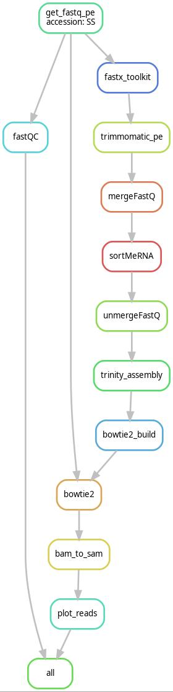
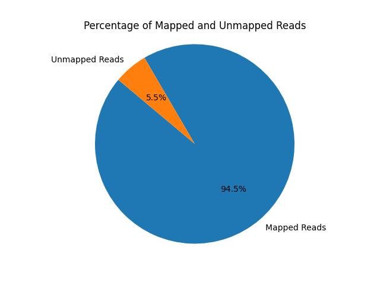

# SRRsSnakeMakePipeline

[](https://snakemake.readthedocs.io)
[](https://docs.conda.io/projects/conda/en/latest/)
[](https://www.python.org/downloads/)
[](https://opensource.org/licenses/MIT)

This directory contains the main pipeline for the course Bioinformatics dataprocessing at Hanze University. The pipeline is (partly) reproduced from the [Scientific report - Raw transcriptomics data to gene specific SSRs: a validated free bioinformatics workflow for biologists](https://www.nature.com/articles/s41598-020-75270-8). The pipeline is a free pipeline that can be used to download and process RNA-seq data.

> The pipeline takes a sample (accession number) as input and processes the data as described below. The output of the pipeline is a pie chart that shows the percentage of reads that are mapped to the (own-assembled) reference genome.

1. This pipeline only works on a linux-based machine.
2. It can **only** take paired-end reads as input.
3. It accepts **only** SRR accession numbers as input.
4. The pipeline is created using Snakemake.

<!-- <details>
<summary>Show table of contents</summary> -->

-------

## Table of contents

- [SRRsSnakeMakePipeline](#srrssnakemakepipeline)
  - [Table of contents](#table-of-contents)
  - [Quick start](#quick-start)
  - [Short description of the pipeline](#short-description-of-the-pipeline)
    - [Used tools/packages](#used-toolspackages)
    - [Snakemake](#snakemake)
    - [Conda](#conda)
  - [Project structure](#project-structure)
  - [Important steps before running the pipeline](#important-steps-before-running-the-pipeline)
    - [Installing the pipeline](#installing-the-pipeline)
    - [Setting up the environment](#setting-up-the-environment)
    - [Setting up parameters and paths](#setting-up-parameters-and-paths)
  - [Graphical overview of the pipeline](#graphical-overview-of-the-pipeline)
  - [Running on SLURM cluster](#running-on-slurm-cluster)
  - [Snakemake report](#snakemake-report)
  - [Example output](#example-output)
  - [Troubleshooting](#troubleshooting)

-------

## Quick start

The pipeline can be used by running the following command:

```bash
snakemake -c all --use-conda --conda-frontend conda
```

> ATTENTION: There are several steps that are needed to be done before running the pipeline. These steps are mentioned below. [Go to steps](#important-steps-before-running-the-pipeline)

-------

## Short description of the pipeline

As mentioned above, the pipeline is a free pipeline that processes RNA-seq data. 
Nowadays, NGS data can be sequenced at a fairly low cost. However, many tools to proces this data are commercial and very expensive. 
Therefore, it's still a challenge to process the data in a cost-effective way. Most bioinformatics tools are fairly standalone. 
In this project, a de novo transcription pipeline is highlighted.

The pipeline contains the following steps:

1. Downloading the data from the SRA database
2. Quality report of the raw reads
3. Trimming the raw reads based on a given quality score
4. Trimming the adapter sequences given a reference file
5. Merging the paired-end reads into one file
6. Remvoving ribosomal RNA sequences with given databases
7. Unmerging the single reads into two files
8. Assembly of the reads into one fasta file
9. Create a reference genome with the assembly
10. Mapping the raw reads to the reference genome
11. Convert the alignment file to a (readable) sam file
12. Create a visualisation of the alignment file (how many reads are mapped to the reference genome)

### Used tools/packages

The following tools are used in this pipeline:


Pysam and Matplotlib are python tools and have to be installed using pip3. The exact steps are mentioned in the [important steps before running the pipeline](#important-steps-before-running-the-pipeline) section.

### Snakemake

This pipeline is created using [Snakemake](https://snakemake.readthedocs.io/en/stable/index.html). Snakemake is a workflow management system that is used to create reproducible and scalable data analyses. The pipeline is created using a Snakefile. The Snakefile contains the rules that are used to process the data.

### Conda

Conda is the environment manager that is used to create the environments for the pipeline. The tools needed for this project are not manually installed, but are installed using conda. This way, the pipeline is more reproducible and scalable. And easier to install on different systems.

The tools are stored inside channels. The channels are defined in a .yaml file. Snakemake uses this file to create the environments. It looks inside the files for which channels are needed and installs the tools from the channels.

-------

## Project structure

The project structure is as follows:

```bash
.
├── README.md
├── adapters
│   ├── *
├── config
│   └── config.yaml
├── dag.jpg
├── dag.png
├── report.html
├── envs
│   ├── *
├── images
├── logs
│   ├── *
├── report
│   ├── *
├── results
│   ├── *
├── slurm
│   └── config.yaml
├── sortme_references
│   ├── *
└── workflow
    ├── Snakefile
    ├── rules
    │   ├── *
    └── scripts
        ├── *
```

-------

## Important steps before running the pipeline

There are some important steps that need to be done before running the pipeline. Make sure, you have enough storage on your machine. The pipeline downloads the data from the SRA database. This can be a lot of data.

### Installing the pipeline

Of course you need this pipeline on your local machine. Clone this repository (in a folder with enough storage) to your local machine using the following command:

```bash
git clone https://github.com/MarkStreek/BioinfDataprocessingExercises.git
```

### Setting up the environment

The following steps are needed to be done for setting up an environment:

1. If not already installed, install miniconda/anaconda/mamba. The process of downloading miniconda (used to create this pipeline) can be found [here](https://docs.anaconda.com/free/miniconda/miniconda-install/). The installation process is fairly easy and can be done in a few minutes.
2. Create a new environment using the following command:

  ```bash
  # Create a new conda environment
  conda create -n new_snake_env
  ```

3. Activate the environment using the following command:

```bash
# activate this environment
conda activate new_snake_env
```

4. Install the snakemake package using the following command:

```bash
# install snakemake from the bioconda channel
conda install -c conda-forge -c bioconda snakemake
```

5. Manually install the python packages (pysam and matplotlib) using the following command:

```bash
# Install pysam
pip3 install pysam

# Install matplotlib
pip3 install matplotlib
```

After these steps are done, the environment is ready to run the pipeline. There are only a couple of things left to do.

### Setting up parameters and paths

The last step before running this pipeline is setting up the config file. The config file is a file that contains the parameters and paths that are used in the pipeline. The config file is a .yaml file and can be found in the `BioinfDataprocessingExercises/SRRsSnakeMakePipeline/config/config.yaml` folder.

1. Navigate to the `BioinfDataprocessingExercises/SRRsSnakeMakePipeline` folder.
2. Copy the output of the following bash command:

```bash
pwd
```

3. Open the `config.yaml` file in the `config` folder.
4. Paste the output of the `pwd` command in the `workdir : ` parameter.
5. Change the `samples_directory : ` parameter to specify the path to the samples directory. This is the directory where the samples are downloaded.
6. Specify which samples you want to download/run. The samples are specified in the `accessions : ` parameter.
7. Additionally, change the flowing parameters to your liking
   1. `threads : `: The number of threads
   2. `memory : `: The amount of memory used (in GB)

After these steps are done, the pipeline is ready to run. Navigate to the `BioinfDataprocessingExercises/SRRsSnakeMakePipeline` folder and run the following command:

```bash
snakemake -c [amount_of_cores] --use-conda --conda-frontend conda
```

Make sure, you still have the environment activated. The pipeline will start running and will download the samples and process them.

> All the pipeline results are placed in the `results/` folder. Logs can be found in the `logs/` folder.

-------

## Graphical overview of the pipeline

<center>



</center>

-------

## Running on SLURM cluster

This pipeline could be runned via a SLURM cluster. If you're on the Hanze BIN network, you can run the pipeline on the SLURM cluster. The pipeline is already set up to run on the SLURM cluster. The only thing that needs to be done is installing the snakemake-executor-plugin-slurm package. This package is used to run the pipeline on the SLURM cluster. The package can be installed using the following command (make sure you have the environment activated):

```bash
pip install snakemake-executor-plugin-slurm
```

After the package is installed, the pipeline can be run on the SLURM cluster using the following command:

```bash
snakemake --profile slurm
```

Don't forget you navigate to the `BioinfDataprocessingExercises/SRRsSnakeMakePipeline` folder before running the command.

-------

## Snakemake report

You could make a report of the pipeline using the folowing command:

```bash
snakemake --report report.html
```

This will create a html report named `report.html` in the `BioinfDataprocessingExercises/SRRsSnakeMakePipeline` folder. 
In this report, you can (interactively) see the steps that are done in the pipeline and see the final result.

An example report is placed in this repo. You can view the report [report.html](report.html).

-------

## Example output

The pipeline is run on the following samples:

```yaml
accessions :
  - SRR2541811
```

Output visualization:

<center>



</center>

-------

## Troubleshooting

In case of errors while creating conda environments, run the following commands while having your environment activated:

```bash
conda config --set channel_priority strict
conda config --add channels defaults
conda config --add channels conda-forge
conda config --add channels bioconda
```

This will set the channel priority to strict and add the necessary channels to the conda configuration.

In case of other errors, please contact the author of this pipeline:

- Mark van de Streek
- [Sent e-mail](mailto:m.van.de.streek@st.hanze.nl)
- [GitHub](https://Github.com/MarkStreek)